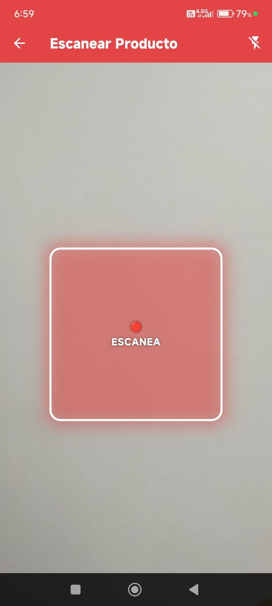
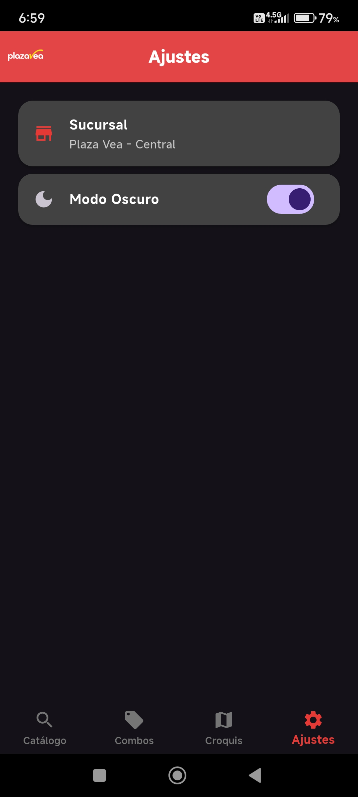
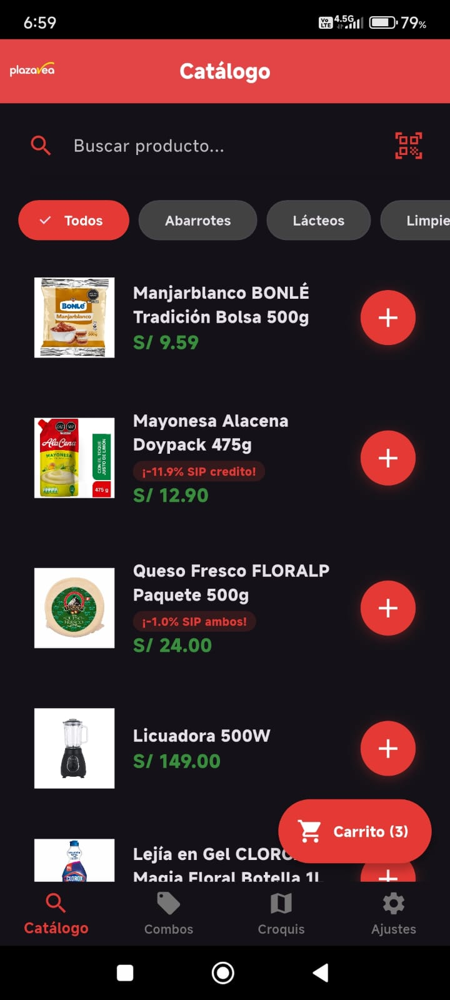
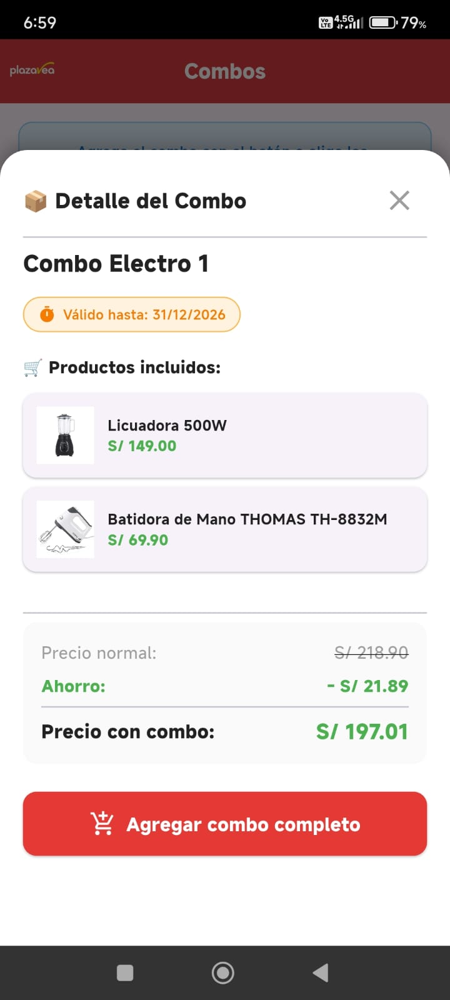
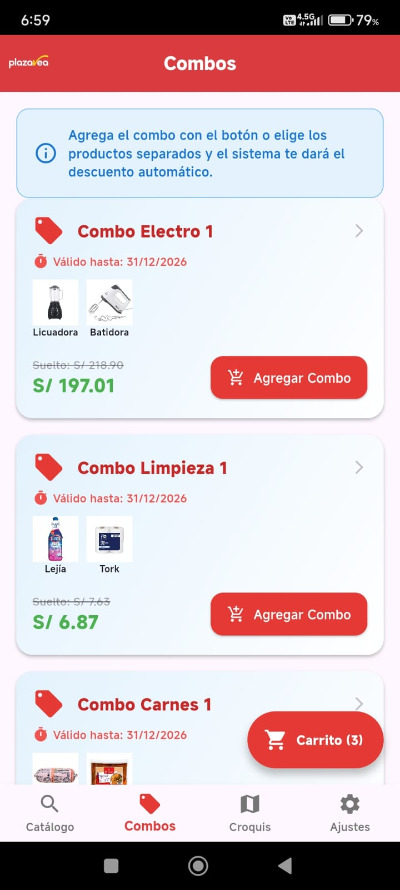
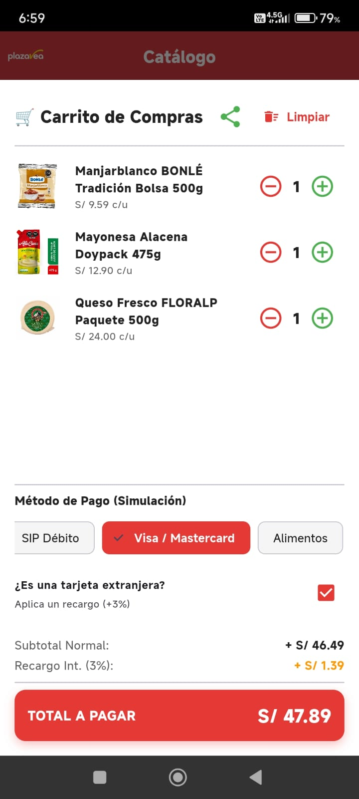
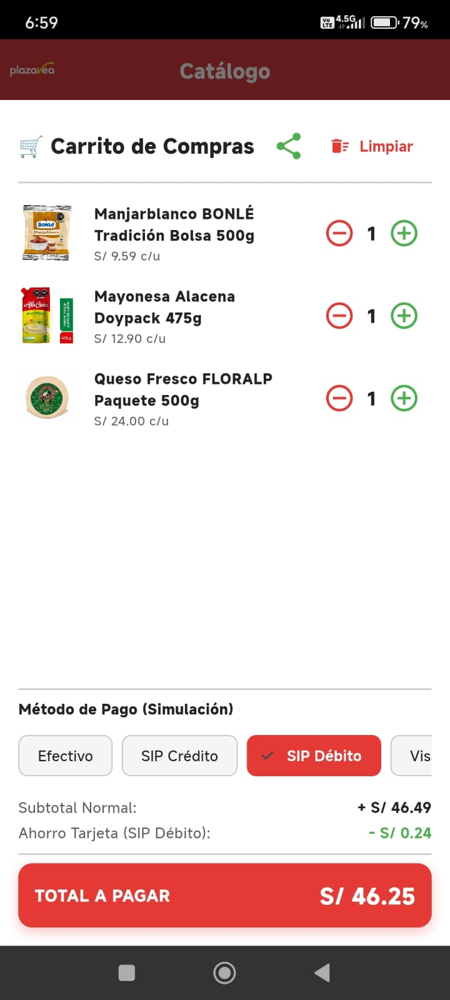
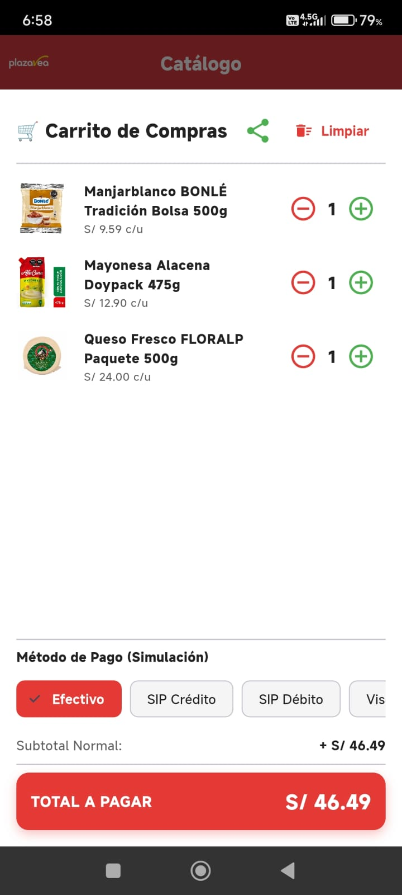
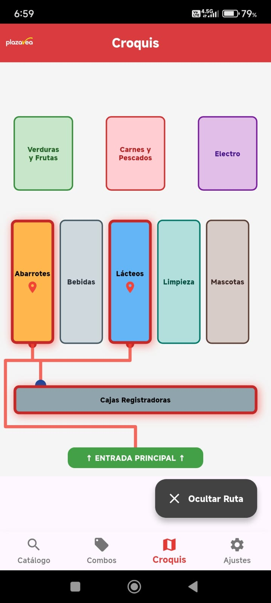
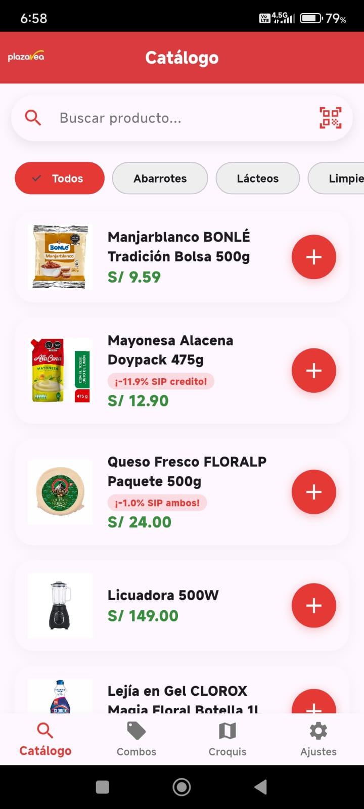

# 🛒 Aplicación Plaza Vea (Proyecto No Oficial)

Bienvenido al repositorio de este proyecto. Aquí podrás descargar el instalador y conocer el proceso de creación de la app.

## 📱 Descarga la App
[Descargar el archivo APK aquí](https://github.com/Rodri-27/APP_PlazaVea/releases/download/v1.0/APP_PlazaVea.apk)

## 💡 El Motivo de la Aplicación
Al trabajar directamente en el área de caja, identifiqué de primera mano los cuellos de botella en los procesos de atención al cliente y la gestión diaria. El objetivo de este proyecto es agilizar estas tareas, aplicando soluciones tecnológicas para resolver problemas reales del piso de ventas y mejorar la eficiencia del servicio.

## ⚙️ Cómo se Desarrolló
La aplicación fue construida íntegramente en Android Studio utilizando el lenguaje Java. Para la arquitectura de la interfaz y la experiencia de usuario, implementé componentes como ListViews para organizar los datos de manera clara, y utilicé Intents explícitos para gestionar la navegación de forma fluida entre las distintas pantallas de la aplicación.

## 📸 Capturas de Pantalla

A continuación se muestra la interfaz y el flujo de la aplicación:

| | |
|:---:|:---:|
|  |  |
|  |  |
|  |  |
|  |  |
|  |  |
